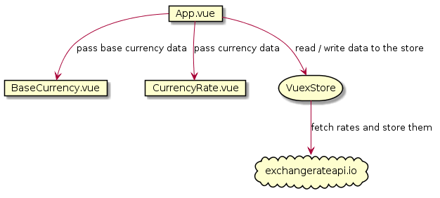

# currency-rate

Currency Rate is a [Vue](https://vuejs.org/) application to calculate a conversion from a base currency (currently set to "USD") to other types of currencies. The application is hosted on Heroku platform: https://shopee-currency-rate.herokuapp.com.

Here is a screenshot of the application (the green/blue highlighted filename maps to the Vue component responsible for rendering it):


## Features
* Updating the amount will also update automatically the rates of each selected currencies.
* Every time a currency is selected / de-selected, the rate is refreshed from the backend.
* [ServiceWorker](https://developer.mozilla.org/en-US/docs/Web/API/Service_Worker_API) is used to cache the static resources. Thus, after you run the application at least once then without a network connection, this application will still run (although it won't be able to fetch any data).
* Material Design with [Vuetify](https://vuetifyjs.com).

## High-level technical implementation



#### App.vue
This is the root component of the application and this is the component that puts everything together. This component owns the dropdown to add a currency. When a currency is selected, it will call Vuex Store's `addCurrency` where the store will update the list and fetch the data from the backend. The new data is read back by App.vue and it will pass the data to the sub-components: BaseCurrency.vue and CurrencyRate.vue.

#### BaseCurrency.vue
This is the component that displays the base currency panel. It's a dumb component where its main purpose is just to display data passed in by App.vue. When the amount textbox is modified, it will emit `newAmount` event to App.vue and App.vue will propagate it down to CurrencyRate.vue so that it can recalculate the total amount.

#### CurrencyRate.vue
This is the component that displays the exchange rate for each of the selected currency. This is also a dumb component where it just displays the data passed in by App.vue. When the user hits the delete button, it will emit `currencyRemoved` event to App.vue and App.vue will call Vuex Store to remove that currency from the list.

#### Vuex Store (store.ts)
This is the main component to manage all the data. In MVC pattern, this is the "M" part. This component manages the main list of the selected currencies so it's responsible of adding / removing currency from the list. When the list is modified, due to Vue reactivity, App.vue will be informed and App.vue will propagate the new information to the sub-components.
This component is also responsible to fetch the rate data from t:wahe backend (exchangerateapi.io) and store them.

## Project setup
```
yarn install
```

### Compiles and hot-reloads for development
```
yarn run serve
```

### Compiles and minifies for production
```
yarn run build
```

### Lints and fixes files
```
yarn run lint
```

### Run your unit tests
```
yarn run test:unit
```
Unit tests are located in `**/__tests__/*.spec.ts`. It's written with [vue-test-utils](https://vue-test-utils.vuejs.org/) and [Jest](https://jestjs.io/) frameworks.
Unit tests test each components independently to ensure they all work as expected in isolation.

### Run your end-to-end tests
```
yarn run test:e2e
```
E2E tests are located in `./tests/e2e/specs/test.js`. Tests are written with [Nightwatch.js](https://nightwatchjs.org/). Unfortunately, due Vuetify isn't E2E friendly (the DOM component's class names are dynamically generated so it's hard to locate the elements programatically), there isn't many tests that can be written.

E2E were only tested with Chrome 76 environment and require that Chrome version to be installed.

### Docker
`Dockerfile` is provided to deploy the app in the docker container. To deploy it:

```bash
# build the docker image
$ docker build . -t currency-rate

# run the the docker image
$ docker run -d -p 8080:80 currency-rate
```
## Future enhancements
These are several features that would be nice to be implemented in the future:

* Responsive design - the design should adjust with the screen size and should be fairly comfortable to be viewed on the small devices.
* Offline support - the data from the backend can be cached locally in [LocalStorage](https://developer.mozilla.org/en-US/docs/Web/API/Window/localStorage) so that it could still display (outdated) data even though there is no internet connection.
